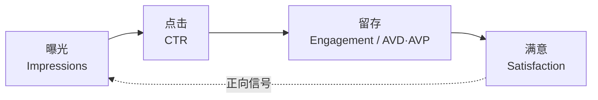

# 01 · 推荐系统心智模型

> 上一篇：[00 导读](00-导读.md) · 下一篇：[02 冷启动](02-冷启动0到1000.md)  
> 目标：用官方语言理解「为什么有人看到你的视频」，并建立可诊断的漏斗。

---

## 目录

1. [一句话模型](#_1-一句话模型)
2. [推荐出现在哪里](#_2-推荐出现在哪里)
3. [官方三桶信号：吸引 · 粘住 · 满意](#_3-官方三桶信号-吸引-·-粘住-·-满意)
4. [创作者侧四段漏斗](#_4-创作者侧四段漏斗)
5. [必须内化的机制](#_5-必须内化的机制)
6. [元数据到底有多重要](#_6-元数据到底有多重要)
7. [神话拆解](#_7-神话拆解)
8. [品类无关的操作含义](#_8-品类无关的操作含义)
9. [本章检查清单](#_9-本章检查清单)

---

## 5分钟速读

> 先扫这几条再往下精读；细节与证据等级见正文。

- 推荐的是「这条视频 × 这位观众」的匹配，不是频道面子或订阅数开关。
- 官方三桶：Appeal（吸引）→ Engagement（粘住）→ Satisfaction（满意）。
- 创作者四段漏斗：曝光 Impressions → 点击 CTR → 留存 → 满意/会话。
- 高 CTR + 低平均观看时长（AVD）= 骗点危险信号；分发易收缩。
- 首页 CTR 常低于搜索 CTR（意图不同），不可横比惊吓。
- 标签是辅助纠错，不是发现引擎；标题/缩图/描述才是主力元数据。

---

## 1. 一句话模型

**【官方】** YouTube 根据「你可能喜欢什么」来推荐视频。系统会比较观众的观看习惯与相似观众，再建议其可能想看的内容。推荐系统每天从大量信号中学习。

对创作者更实用的转述：

> 推荐的是 **「这条视频 × 这位观众」的匹配预测**，不是「你的频道有多大」。

冷启动难，是因为早期信号少；不是因为系统「歧视小频道」这一简单神话。

主信号（观众侧，官方列举）包括：观看历史、搜索历史、订阅、赞/踩、「不感兴趣」「不要推荐该频道」、满意度问卷等。不同表面（首页 / 下一条 / Shorts）对信号的权重不同。

---

## 2. 推荐出现在哪里

**【官方】** 常见推荐表面包括：

| 表面 | 创作者直觉 |
|------|------------|
| **首页 Home** | 个性化为主；登录后混合推荐、订阅、资讯等 |
| **Up Next（下一条）** | 强依赖「当前正在看的视频」 |
| **Shorts 播放器** | 信息流个性化「下一条短视频」 |
| **主题目的地页** | 购物、音乐、影视等；部分货架可个性化 |
| **频道页货架** | 也可能按「你可能感兴趣」排序 |

**【官方要点】**：首页推荐**主要**依赖观看历史；Up Next **主要**依赖当前视频。关掉观看历史会改变首页体验。

**操作含义**：  
- 想进别人视频的「下一条」→ 内容主题邻近、包装清晰、观看体验好，比堆标签重要。  
- 想反复出现在某类用户首页 → 让对的人完整看完并感到满意，积累正向历史。

---

## 3. 官方三桶信号：吸引 · 粘住 · 满意

**【官方】** 内容表现可理解为三组信号，用于预测「会不会看、会不会喜欢」：

1. **Appeal（吸引）**：人们是选择观看，还是忽略 / 点「不感兴趣」？  
2. **Engagement（粘住）**：开始看以后，是否留下来？  
3. **Satisfaction（满意）**：看完是否觉得值得？（含问卷等）

官方同时给创作者侧建议：

- **构思**：即使在细分领域，也可用更「日常可感」的问题作入口（举例：别只写深奥市场分析标题，可写成「为什么你的咖啡这么贵？」这类入口）。  
- **包装**：标题与缩图传达价值、激发兴趣、设定清晰预期。  
- **钩子**：片头几秒决定去留；必须兑现缩图/标题承诺。  
- **叙事**：用期待与好奇维持观看；用分析看关键时刻反应。

---

## 4. 创作者侧四段漏斗

把官方三桶翻译成工作室周会语言：

> 读法：任一环断裂，下游与回流分发都会弱。高 CTR + 低 AVD 是最常见的「假繁荣」。

| 阶段 | 含义 | 常看指标 | 失败信号 |
|------|------|----------|----------|
| **曝光 Impressions** | 系统把封面/标题塞进各表面 | 曝光量、流量来源 | 长期几乎无曝光 → 选题/受众匹配弱或早期样本不足 |
| **点击 CTR** | 包装是否赢得点击 | 印象点击率（Impressions CTR） | 高曝光 + 极低 CTR → 包装弱 |
| **观看 / 留存** | 是否兑现承诺 | 平均观看百分比/时长、Intro（约前 30 秒）、留存曲线 | 高 CTR + 低观看时长 → 典型「骗点」，分发易收缩 |
| **满意 / 会话** | 是否值得再推、是否延长会话 | 赞与「不感兴趣」、问卷、后续点击、播放列表连播 | 点完就走、会话断、系列无法连播 |

**【官方】** 关于 CTR：若用误导性标题/缩图抬高 CTR，但平均观看时长差，视频会更难被推荐。诊断句式常是「高 CTR + 低平均观看时长 + 曝光不如预期」。

**【官方】** 关于 CTR 区间：许多频道/视频的印象 CTR 落在大约 **2%–10%**；首页大曝光时 CTR 偏低很常见；来自频道页的 CTR 偏高也常见。**不要**拿不同来源的 CTR 横比后惊慌。

**【官方 · 解码 CTR】** 搜索场景意图强 → CTR 常更高；首页发现心态 + 竞争强 → CTR 常更低。完整点选路径与诊断脚本见 [07 · 如何读 Studio 分析](07-频道装修与Studio.md)。

**专家口诀**：先问「这个 CTR 来自哪类表面？」，再问「好不好」。

---

## 5. 必须内化的机制

1. **没有单一「订阅数开关」决定推荐。**【行业实践解释小频道神话】**；官方强调的是观众行为与满意度信号。  
2. **时长不是目标函数。**【行业实践 / VidCon 公开讨论】**：视频该多长就多长；硬拉时长若留存差，适得其反。  
3. **发布频率本身不是奖励点。**【行业实践】**：系统奖励的是满意的观看体验；劣质日更可能伤害会话与订阅质量。  
4. **Shorts 与长视频是不同消费情境**，观众可能重叠也可能完全分离；转化需要刻意设计（见第 06 章）。【官方 Blog】  
5. **2026 质量取向**：低质重复、垃圾搬运、空洞 AI 量产，面临推荐与变现双重压力。【官方 CEO 信 + Shorts 原创更新 + 变现政策澄清】

---

## 6. 元数据到底有多重要

**【官方】** 标题、缩图、描述是重要元数据。**标签有帮助但不是发现所必需**；标签主要用于帮助纠正常见拼写错误（如 YouTube / U Tube / You-tube）。

**【神话】**「堆 15 个热门标签就能上推荐。」  
**【纠正】** 发现主力是观众行为 + 包装与内容匹配；标签是辅助，不是引擎。

描述仍建议：前几行说清内容与时间戳；自然语言；相关链接；避免关键词墙。

---

## 7. 神话拆解

| 神话 | 更接近事实 |
|------|------------|
| 「小频道永远没推荐」 | 推荐看视频×观众匹配；小频道缺的是早期信号与目录，不是永久黑名单。【行业实践梳理 + 官方机制描述】 |
| 「必须每天发」 | 可持续的质量节奏通常优于燃烧式日更。【行业实践】 |
| 「10 分钟是魔法时长」 | 无官方魔法时长；留存与满意度优先。【行业实践】 |
| 「标题党短线赚曝光」 | 可能短线抬 CTR，但低观看时长会伤害后续推荐。【官方 CTR FAQ】 |
| 「关掉再重传能洗推荐」 | 通常浪费；应改包装/内容/定位，而不是迷信「重置」。【行业常见建议；非官方功能】 |
| 「Shorts 播放高=频道成功」 | Shorts 触达大，但订阅与长视频转化要另建桥。【官方 Related 指南】 |

---

## 8. 品类无关的操作含义

无论你做教程、评测、游戏、叙事还是生活：

1. **先定义「谁会满意」**，再拍电影级设备。  
2. **每条视频问三句**：谁会点？点开后 15 秒是否确认没点错？看完是否觉得值？  
3. **用流量来源解读数据**：搜索型内容与浏览型内容的健康 CTR/留存长得不一样。  
4. **系列与播放列表**是提高会话的产品设计，不是可有可无的整理癖。  
5. **把「算法」翻译成「观众」**：什么时间发 → 观众何时在线；推不推 → 看完的人是否还想再看一条。

叙事/悬疑示例（可替换成你的品类）：包装制造「未闭合好奇」，开场必须立刻进入冲突现场——这是官方「兑现承诺」在故事类的落地，不是悬疑专属玄学。

---

## 9. 本章检查清单

- [ ] 能向朋友用 30 秒解释「推荐不是按订阅数发粮」  
- [ ] 知道首页 vs Up Next 主信号差异  
- [ ] 能默写 Appeal / Engagement / Satisfaction  
- [ ] 会把「高 CTR + 低 AVD」当成危险信号（详见 [12](12-反例与失败模式.md)）  
- [ ] 知道搜索 CTR 与首页 CTR 不可横比惊吓  
- [ ] 不再把标签当核心增长策略  
- [ ] 能指出至少三个常见算法神话的错误处  

**下一章**：把心智模型落成 0→1000 的阶段作业。

---

## 本周作业

> 2–5 件可完成的具体动作；做完打勾，再进下一章。

1. [ ] 用 30 秒向朋友口述「推荐不是按订阅发粮」；录语音自听是否清楚。
2. [ ] 在纸上默写四段漏斗 + 每段失败信号（对照本章表）。
3. [ ] 打开 Studio 任一条视频，记下其最大流量来源与该来源 CTR（样本太小也先练路径）。
4. [ ] 列出你曾信过的 2 个算法神话，对照本章表写出纠正句。
