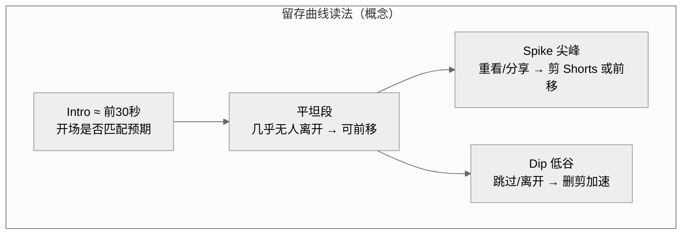

# 05 · 脚本、留存与完播

> 上一篇：[04 包装](04-标题封面与包装.md) · 下一篇：[06 Shorts 漏斗](06-Shorts漏斗.md)  
> 目标：让点进来的人愿意留下来，并在关键时刻获得「值」的感觉。

---

## 目录

1. [官方怎么谈留存](#1-官方怎么谈留存)
2. [Studio「关键时刻」怎么用](#2-studio关键时刻怎么用)
3. [开场 30 秒铁律](#3-开场-30-秒铁律)
4. [通用结构：教学 / 评测 / 故事 / Vlog](#4-通用结构教学--评测--故事--vlog)
5. [叙事节拍表示例（8–18 分钟）](#5-叙事节拍表示例8–18-分钟)
6. [留存钩子工具箱](#6-留存钩子工具箱)
7. [剪辑纪律与字幕](#7-剪辑纪律与字幕)
8. [时长迷思](#8-时长迷思)
9. [本章检查清单](#9-本章检查清单)

---

## 5分钟速读

> 先扫这几条再往下精读；细节与证据等级见正文。

- 开场必须兑现缩图/标题承诺；片头几秒决定去留。【官方】
- 关键时刻：Intro（约前 30 秒）· Spike（重看尖峰）· Dip（离开低谷）。
- 开场 30 秒三句：画面/结果 → 一句话赌注 → 路线图（禁 Logo→自我介绍→求订阅）。
- 结构随品类变，原则不变：删不推动承诺的段落；每 45–90 秒一个增量。
- 钩子工具箱服务 Satisfaction，不是操纵；完播/高 AVP 要对照自己基线。
- 时长无魔法数；注水毁留存。Spike 可剪成 Shorts。

---

## 1. 官方怎么谈留存

**【官方】** 片头几秒决定去留；开场必须**兑现缩图与标题的承诺**，简洁地进入价值。维持兴趣靠叙事：建立期待与好奇；用分析测量观众在关键时刻的反应。

**【官方】** Engagement 桶关心：开始看以后是否留下来。Satisfaction 关心：是否觉得值得。

完播（口语）或高平均观看百分比（AVP）是健康信号之一，但不同时长、品类、流量来源的「好」不一样——用自己历史基线比，用留存曲线找可剪段落，而不是迷信单一百分比。

---

## 2. Studio「关键时刻」怎么用

**【官方 · Measure key moments】** 观众留存报告（视频级；通常需一定观看量与时长才完整；出数可能有 1–2 天延迟）：

| 信号 | 含义 | 动作 |
|------|------|------|
| **Intro**（约前 30 秒仍在看的比例） | 开场是否匹配预期 | 改开场或改包装 |
| **平坦段** | 几乎无人离开 | 把这类内容前移 |
| **渐降** | 常见流失形态 | 压缩低信息密度 |
| **尖峰 Spike** | 重看/分享点 | 可做成 Shorts；或更早出现 |
| **低谷 Dip** | 跳过或离开 | 删、剪、加速、改转场 |

**【行业实践】** 许多头部创作者公开表示自己极度看重留存曲线，并据此改后续内容。

> 对照漏斗：CTR 好而 Intro 崩 = 包装/开场问题；中段 Dip 密 = 结构与信息密度问题。

### 首次打开留存报告（新手步骤）

1. Studio → 内容 → 选一条 **观看量相对最高** 的长视频（样本太小曲线噪声大）。  
2. 分析 → 参与 / 观众留存（名称以界面为准）。  
3. 先看 **Intro**：前 30 秒是否掉过自己近作中位数。  
4. 沿曲线找最深 **Dip**：记下时间码，回放那 20 秒，问「信息增量是否为零」。  
5. 找 **Spike**：能否剪成 Short；或能否把爽点前移。  
6. 只改一个问题：开场 **或** 某一个 Dip，不要一次重剪整集。  

更完整的「来源→CTR→Intro→曲线」顺序见 [07](07-频道装修与Studio.md)。典型失败「高 CTR 低留存」见 [12](12-反例与失败模式.md)。

---

## 3. 开场 30 秒铁律

**三句话模板（可背）**

1. **画面/结果承诺**：直接给冲突、成果预览、或问题现场  
2. **一句话赌注**：为什么值得留下  
3. **路线图**：今天只承诺 1 个核心问题或结果（不要预告五项拖时间）

**错误示范**：Logo 动画 → 自我介绍 → 「请订阅」→ 赞助口播 → 才开始承诺内容。

**Shorts 导流例外**：若观众来自某条 Short，长视频前 5–10 秒必须先接住 Short 的问题【官方 Related 指南】——这与「禁止无意义片头」一致。

---

## 4. 通用结构：教学 / 评测 / 故事 / Vlog

### 教学

1. 问题与错误代价（钩子）  
2. 今天学会什么（承诺）  
3. 步骤 1…n（每步一个小结果）  
4. 常见坑  
5. 完整复盘 / 模板下载 CTA  
6. 下一课钩子 + 结束画面  

### 评测 / 科技

1. 结论先行（或强烈使用场景）  
2. 测试方法透明  
3. 分项（性能/体验/价格）  
4. 对比对象  
5. 「谁该买/谁不该买」  
6. 时间戳目录  

### 故事 / 叙事

见下一节节拍表。核心：每 45–90 秒一个信息增量或情绪转向。

### Vlog / 生活

1. 今日「悬念或目标」  
2. 过程中的决策点（不是流水账早餐）  
3. 失败或意外  
4. 收获一句  
5. 下期预告  

**共同原则**：删掉不推动承诺的段落；「气氛空镜」必须承载信息。

---

## 5. 叙事节拍表示例（8–18 分钟）

> 适用于故事、案件复盘、人物转折；其他品类可映射为「冲突→升级→反转→结算」。

| 时间 | 节拍 | 任务 |
|------|------|------|
| 0:00–0:15 | 钩子冷开 | 兑现封面；禁问候 |
| 0:15–0:45 | 承诺与赌注 | 今天要解开什么 |
| 0:45–2:00 | 世界与人物 | 最小必要背景 |
| 2:00–5:00 | 第一幕升级 | 第一反转/新证据 |
| 5:00–8:00 | 误导与压力 | 让观众暂信错误答案 |
| 8:00–12:00 | 第二反转 | 提高 stakes |
| 12:00–15:00 | 高潮结算 | 给可感知收获 |
| 最后 20–40 秒 | 余韵+会话钩 | 口播下一集/列表 |

短于 10 分钟：合并误导与第二反转。接近 18 分钟：中点刷新「还差一个关键问题」。

---

## 6. 留存钩子工具箱

1. **开放循环**：先给结果碎片，后补因果  
2. **But/Therefore**：用「但是/因此」推进，少「并且并且」  
3. **倒计时**：截止日、预算、电池、开庭  
4. **模式中断**：节奏突变、短暂停顿、视角切换  
5. **问题句切章**：「那这一步为什么会失败？」  
6. **回调**：片头细节在高潮回收  
7. **进度条感知**：教学中明示「还剩 2 步」  
8. **代价可视化**：不听建议会发生什么  

钩子是工具，不是操纵：最终仍要让 Satisfaction 成立。

---

## 7. 剪辑纪律与字幕

- 对白密度不够就上关键句字幕/卡片  
- 中文字幕：关键词高亮，避免整屏墙字  
- 音量稳定；噪音大于「电影感」  
- 每完成一集：对照留存，把 Spike 做成 1–2 条 Shorts  
- 删「为凑时长」的重复解释  

---

## 8. 时长迷思

**【神话】**「必须 10 分钟才能推荐/赚钱。」  
**【纠正】** 广告与推荐都不等于「越长越好」。合格观看时长与广告插入有规则，但硬注水会毁留存。【行业实践 + 官方留存逻辑】

正确问题：这个承诺需要多长才能讲清并令人满意？

---

## 9. 本章检查清单

- [ ] 开场 15 秒内进入承诺内容  
- [ ] 会读 Intro / Dip / Spike  
- [ ] 结构匹配品类；有明确结算  
- [ ] 片尾有收获 + 下一跳  
- [ ] 不为算法注水  
- [ ] 计划从 Spike 剪 Shorts  

**下一章**：用 Shorts 发现观众，并桥接到长视频。

---

## 附录 · 各品类「前 15 秒」口播骨架

**教程**：「如果你【错误做法】，会【代价】。接下来 10 分钟只做一件事：【结果】。」  
**评测**：「结论先说：【对象】适合【谁】，不适合【谁】。下面用【测试】证明。」  
**故事**：「【时间地点】，【异常事实】。今天要弄清的只有一个问题：【问题】。」  
**观点**：「很多人相信【流行看法】。我做过【经历】之后，结论相反：【立场】。」  
**游戏/直播精剪**：「这一局【赌注】。看我在【分钟】犯的那个决定性错误。」  

录完冷听：若 15 秒内听不出「我该不该留下」，重录开场，不要先堆中段。

---

## 本周作业

> 2–5 件可完成的具体动作；做完打勾，再进下一章。

1. [ ] 打开观看量最高的一条长视频留存报告，标出 Intro%、最深 Dip 时间码、最高 Spike 时间码。
2. [ ] 只改一个问题：重录/重剪开场 **或** 砍掉一个 Dip 段（不要整集重剪）。
3. [ ] 用附录骨架重写下一条的前 15 秒口播，冷听：听不出「该不该留下」就再改。
4. [ ] 从本周 Spike 计划剪 1–2 条 Shorts（先列时间码即可）。
