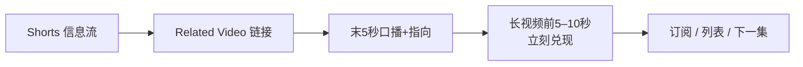

# 06 · Shorts 漏斗：从刷到订再到长视频

> 上一篇：[05 留存](05-脚本留存与完播.md) · 下一篇：[07 Studio 与装修](07-频道装修与Studio.md)  
> 目标：把 Shorts 的触达变成频道增长，而不是「空播放」。  
> Shorts 怎么分钱（创作者池、音乐 1/2 与 1/3、45%）→ [Shorts 收益怎么分配](shorts-收益分配.md)

---

## 目录

0. [Shorts 播放高不涨粉怎么办？](#shorts-播放高不涨粉怎么办)
1. [官方如何看待 Shorts 观众](#_1-官方如何看待-shorts-观众)
2. [2026-10 原创优先更新](#_2-2026-10-原创优先更新)
3. [官方四步：Related Video 转化法](#_3-官方四步-related-video-转化法)
4. [Shorts 内容矩阵](#_4-shorts-内容矩阵)
5. [从长视频生产 Shorts](#_5-从长视频生产-shorts)
6. [衡量转化](#_6-衡量转化)
7. [竖屏直播（可选实验）](#_7-竖屏直播-可选实验)
8. [失败模式](#_8-失败模式)
9. [本章检查清单](#_9-本章检查清单)

---

## 5分钟速读

> 先扫这几条再往下精读；细节与证据等级见正文。

- Shorts 观众分层：只看短 / 情境依赖 / 探索型——不做会隐形，做了无桥难转化。
- 2026-10 起 Shorts 更优先原创；无实质搬运/刮擦分发风险上升。
- 官方四步：Related Video → 末 5 秒强 CTA → 长视频前 5–10 秒接住 → 可选竖屏直播。
- 每条长视频衍生 2–4 条 Shorts；切片也须独立成立。
- 转化看长视频流量来源里的 Shorts；按季度看趋势，勿因单条情绪停更。
- 失败速修：空播放 → 走完四步；粉涨播放空 → 选题贴回内容桶。

---

## Shorts 播放高不涨粉怎么办？

**A.** 高播放只说明短视频流里「划走率/完播」可能过关，**不等于**订阅或长视频转化。优先走完官方 **Related Video 四步**（见下文 §3）：挂相关长视频 → 末几秒口头+视觉 CTA → 长视频前几秒接住承诺 → 用 Studio 看来自 Shorts 的长视频流量。切片也须**独立有价值**；2026-10 后无实质搬运分发更差。【官方 Blog 2026-07-14】

---

## 1. 官方如何看待 Shorts 观众

**【官方 Blog · 2026-07-14】** Shorts 日活触达巨大，但受众高度分层：

- **只看 Shorts**：可能几乎不点 10 分钟视频  
- **情境依赖**：某类主题看长、另一类只看短  
- **探索型**：用 Shorts 发现新频道，再决定是否投入长内容  

因此：不做 Shorts，会对某些人群「隐形」；做了 Shorts 却不建桥，则难转化。Shorts 不只是预告片工具，也是**新观众入口**。

CEO 2026 信提及 Shorts 约 **2000 亿次/日**级观看量级（公开信表述）——说明供给极多，**质量与原创**成为差异化关键。

---

## 2. 2026-10 原创优先更新

**【官方立场 · 经 TeamYouTube / Creator 渠道于约 2026-10-01 传达；多家媒体引述一致】**

- 更新 Shorts 推荐，**进一步优先原创**  
- **降低**「从其他创作者搬运且不加自己东西」的触达  
- 与垃圾信息政策一致：避免无实质加工的转载；使用他人片段时，应加入原创解说、独特剪辑或叙事等**真实价值**  
- 「主要做聚合/搬运且改动很小」的频道，可能在 Shorts 信息流中分发变少  
- 转帖/引用式讨论仍可存在，但应带来自己的观点  

**未公开**：精确阈值日期、量化阈值、「仪表盘显示你是否被打标」。

**实操底线**：

- 优先：自己拍摄、自己长视频切片（本身已是你的内容）、显著改编+观点  
- 高风险：无解说搬运、轻微调速/滤镜、模板化批量「伪原创」  
- 想分享他人视频给粉丝：可用社区帖等指向**原上传**（Creator 侧建议方向）

**【神话】**「剪别人视频加字幕就算原创。」  
**【纠正】** 官方强调的是 substantive value；小改技术项不够。

---

## Shorts Related Video 怎么设置？

**A.** 【官方】在 Short 上挂**相关长视频**（Related Video），片尾口头+画面 CTA，并确保长视频开场立刻兑现 Short 承诺；再用 Studio 看来自 Shorts 的长视频流量。四步详见下文。主文献见 [YouTube Blog / Creator](https://blog.youtube/) 2026-07 Related Video 转化说明（以当日官博为准）。

---

## 3. 官方四步：Related Video 转化法

来源：【官方 Blog】How to convert YouTube Shorts views into long-form channel growth（2026-07-14）

> 桥断在任何一格，都会变成「空播放」。切片本身也须独立成立。

### Step 1 · 挂 Related Video

Studio → 内容 → 该 Short → **Related video** → 选同频道目标片（长视频/直播/另一 Short）。

**匹配意图**：教小技巧 → 链完整教程；产品亮点 → 链完整评测；故事钩子 → 链完整那一集。

### Step 2 · 末 5 秒强 CTA

观众不会「因为链接存在」而点。需要：

- **口播**：明确说点哪里、得到什么  
- **视觉**：手指向链接区域，或闪一下长视频封面  

### Step 3 · 长视频前 5–10 秒立刻兑现

禁止慢热 Logo/无关近况。Short 吊起的问题，长视频开头必须接住——否则滑动离开。

### Step 4 ·（可选）竖屏直播

竖屏直播可进入 Shorts 相关发现场景；也可电脑端尝试横+竖双流（以 Studio 当前功能为准）。

**额外官方提醒**：从长视频剪出的 Short 也须**独立成立**，不能只有「完整版在主页」而无价值。

---

## 4. Shorts 内容矩阵

| 类型 | 结构 | 导向 |
|------|------|------|
| 高潮切片 | 最强 20–40 秒 | Related → 本集 |
| 冷开钩子 | 异常/结果，不给全答案 | Related → 本集 |
| 单点教学 | 一个可立即用的技巧 | Related → 完整课 |
| 对比一秒懂 | Before/After | Related → 评测 |
| 系列预告 | 「下一集门口」 | Related → 下一集 |
| 评论答疑 | 答高频问题 | Related → 深度集 |

生产建议：每条长视频衍生 **2–4** 条 Shorts（独立钩子 + 切片 + CTA 向）。

---

## 5. 从长视频生产 Shorts

**【官方 Help】** 可将自己已上传的公开长视频「Edit into a Short」：选取最长约 60 秒等（以产品为准），并可加文字特效。私享/未列出、或有第三方版权声明的视频可能不可用。

策略：

1. 先看长视频留存 Spike，再剪  
2. 为信息流重剪：更大字幕、更早冲突、竖屏构图  
3. 挂 Related，并改长视频开头以承接  

---

## 6. 衡量转化

- 长视频分析 → 流量来源 → Shorts  
- 内容总览中的跨格式观众（若有）  
- 订阅来源（若 Studio 提供拆分）  

**【预期管理】** 转化率通常不高；按季度看趋势，勿因单条 Short 情绪化停更。

关于 Shorts「观看」计数：产品定义可能调整（例如区分是否需要最短观看、以及 Engaged views 等）。分析时读清 Studio 指标说明，避免跨年硬比。

---

## 7. 竖屏直播（可选实验）

**【官方 Blog】** 手机创建 → 直播；首次可能有等待。电脑 Studio 可尝试 Dual stream（横+竖）。当作实验位，不要牺牲长视频产能。

---

## 8. 失败模式

| 失败 | 原因 | 修复 |
|------|------|------|
| 空播放 | 无桥、无 CTA、长视频不接 | 走完官方四步 |
| 粉涨播放空 | Shorts 受众与定位不符 | 改选题贴近内容桶 |
| 分发骤降 | 搬运/模板感 | 提高原创与差异 |
| 只做 Shorts 无目录 | 品牌与搜索资产弱 | 恢复长视频周更 |
| 刮擦搬运分发骤降 | 2026-10 原创优先 | 停伪原创；改自有内容（见 [12](12-反例与失败模式.md)） |

---

## 9. 本章检查清单

- [ ] 理解三类 Shorts 观众  
- [ ] 新 Short 默认检查原创价值  
- [ ] Related Video 已挂且主题匹配  
- [ ] 末 5 秒口播+指向  
- [ ] 长视频开头接住承诺  
- [ ] 每条长视频有 Shorts 衍生计划  

**下一章**：频道页与 Studio 工具台。

---

## 本周作业

> 2–5 件可完成的具体动作；做完打勾，再进下一章。

1. [ ] 选 1 条已发/将发 Short：挂上意图匹配的 Related Video（长视频优先）。
2. [ ] 为该 Short 补拍或确认末 5 秒：口播「点这里看完整…」+ 手指/闪封面。
3. [ ] 检查目标长视频前 10 秒是否接住 Short 的问题；不接就重做开场。
4. [ ] 从最近长视频 Spike 列出本周 2 条 Shorts 选题（独立钩子各一）。
