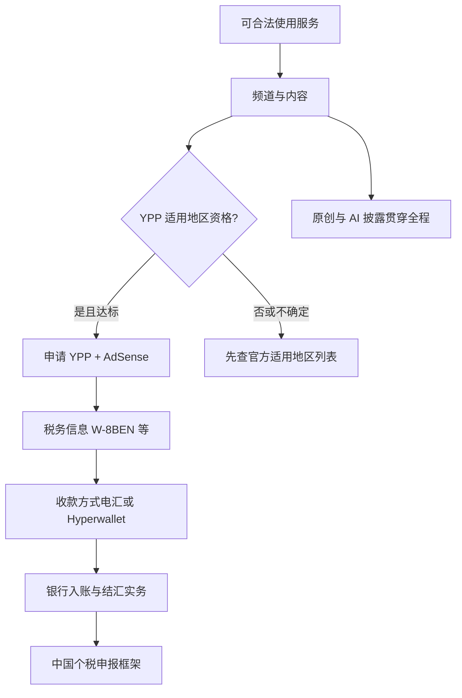
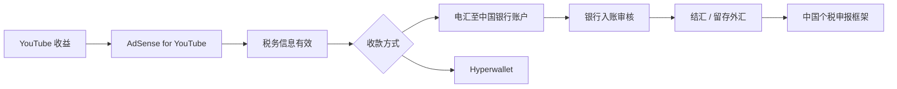

# 13 · 中国大陆创作者专章

> 基准日期：**2026-10-06**（Asia/Shanghai）  
> 上一篇：[12 反例与失败模式](12-反例与失败模式.md) · 相关：[09 变现与合规](09-变现与合规红线.md) · [11 FAQ](11-常见问题FAQ.md)  
> 目标：回答「国内怎么做油管」背后的真实关卡——**地区资格、收款、税务、原创**——并全部可回溯到公开来源。

---

## 目录

1. [合规与网络前提（先读）](#1-合规与网络前提先读)
2. [账户、频道与地区选择](#2-账户频道与地区选择)
3. [YPP：门槛与适用地区](#3-ypp门槛与适用地区)
4. [AdSense 收款：电汇、银行与结汇](#4-adsense-收款电汇银行与结汇)
5. [美国税务信息（W-8BEN）](#5-美国税务信息w-8ben)
6. [中国个人所得税框架](#6-中国个人所得税框架)
7. [搬运、二次利用与 Shorts 原创](#7-搬运二次利用与-shorts-原创)
8. [双平台：B 站 / 抖音 / 视频号](#8-双平台b-站--抖音--视频号)
9. [AI 配音与合成内容披露](#9-ai-配音与合成内容披露)
10. [高意图 FAQ（可直接回答搜索）](#10-高意图-faq可直接回答搜索)
11. [本章检查清单](#11-本章检查清单)
12. [本周作业](#本周作业)

---

## 5分钟速读

> 先扫这几条再往下精读；细节与证据等级见正文。

- **网络**：稳定访问 YouTube / Studio / AdSense 是创作前提；本指南**不提供**任何规避本地网络管理的操作说明。【合规】
- **YPP 地区**：【官方】须居住在已推出 YPP 的国家/地区。截至 **2026-10-06** 核对，[适用地区列表](https://support.google.com/youtube/answer/7101720?hl=zh-Hans)含**香港、台湾**等，**名单中未见「中国」**。请打开原链核对当日。
- **收款**：【官方】收款地址为**中国**时，AdSense / YouTube 支持**电汇**与 **PayPal Hyperwallet**。入账成败还受银行与外汇实务影响。【行业实践】
- **美税**：全球 YPP 创作者都要交美国税务信息；未提交可能面临更高预扣。中国税收居民常见路径为 **W-8BEN** + 税收协定主张；条约特许权使用费常见上限 **10%**（以 IRS 文本与后台显示为准）。
- **中国税**：中国税收居民的境外所得有申报义务框架；**本文非税务意见**。
- **原创**：搬运无实质改造 → 变现与 Shorts 分发双杀；AI 写实合成要披露，克隆自己声音旁白通常免披露。【官方】
- **神话拆穿**：【神话】「中国 AdSense 完全收不到钱」——与官方付款国家表不符；【神话】「随便选个高 RPM 国家」——虚假税务居民身份属于高风险，本指南不教。

---

## 1. 合规与网络前提（先读）

### 1.1 本站立场

本专章服务**合法、可持续**的华语/大陆背景创作者：

- 遵守你所在地的法律法规与平台规则  
- **不**提供虚假互动、刷量、关键词堆砌、规避平台或本地法规的方法  
- 税务与外汇仅整理**公开政策线索**，**不构成法律、税务或投资建议**

涉及金钱与合规（YMYL）时，优先引用 Google / YouTube Help、IRS、国家外汇管理局与税务机关公开文件；第三方实操标【行业实践】并注明日期。

### 1.2 网络访问（仅作前提说明）

创作、上传、数据分析、关联 AdSense，都需要你能使用 YouTube 与 Google 相关服务。

**【合规表述】**：请自行确保网络使用方式符合你所在地的法律法规与服务条款。本指南**不讨论、不示范**任何规避网络管理的技术或产品。

### 1.3 与全书的关系

| 主题 | 去哪读 |
|------|--------|
| 推荐、冷启动、包装、Shorts 漏斗 | 01–08 章 |
| YPP 门槛数字、质量红线、虚假互动 | [09](09-变现与合规红线.md) |
| 通用 Q&A | [11](11-常见问题FAQ.md) |
| 文献对照 | [SOURCES](SOURCES.md) |

本专章只补：**大陆创作者搜索意图最强、且全书其他章写得不够细的「地区 × 收款 × 税务 × 原创」**。

---

## 2. 账户、频道与地区选择

### 2.1 基础设置（通用）

**【官方 / 行业实践】** 常见顺序：

1. Google 账号安全：开启**两步验证**（YPP 条件之一）  
2. 创建频道 → 完善头像、横幅、简介、默认语言  
3. YouTube Studio：上传默认设置、权限与高级功能相关验证  
4. 规划内容语言与**目标观众地理**（见 [00 导读 §6](00-导读.md)）

手机号验证等权限细节以 Studio 当前提示为准；不同地区可用功能可能不同。

### 2.2 「国家/地区」到底影响什么？

公开文档里，至少有几层容易被自媒体混为一谈：

| 层级 | 大致含义 | 你该怎么做 |
|------|----------|------------|
| YPP **居住地 / 适用地区** | 【官方】须在已推出 YPP 的国家/地区 | 打开 [适用地区列表](https://support.google.com/youtube/answer/7101720?hl=zh-Hans) 核对 |
| AdSense **收款地址国家** | 决定可用付款方式（如中国：电汇 + Hyperwallet） | 见 [付款方式表](https://support.google.com/adsense/answer/1714397?hl=zh-Hans) |
| **税务居民国** | 决定填 W-8BEN / W-9 等及协定待遇 | 以真实税务居民身份为准；勿虚假申报 |

**【神话】**「为了 RPM 更高，注册时随便选美国/某国。」  
**【拆穿】** 税务与付款资料长期不一致、虚假居民身份，可能导致预扣异常、账号审核失败乃至更严重合规后果。本指南**不提供**「选区套利」操作。

**【行业实践】** 若你的真实生活、税务居民身份与收款安排本身就跨司法辖区（例如合法居住在香港、台湾或其他名单内地区），以**当地合格顾问**与官方后台选项为准，而不是论坛口令。

### 2.3 开频道前的三问（写下来）

1. 我的**目标观众**主要在哪（海外华人 / 东南亚 / 英语市场 / 其他）？  
2. 我的**税务居民**身份是什么（自己确认，不猜测）？  
3. 我是否已打开官方页，确认 **YPP 是否对我适用**？

答不清就先做内容与受众，不要先纠结「收款神话」。

---

## 3. YPP：门槛与适用地区

### 3.1 门槛（数字以 Help 当日为准）

**【官方】** 截至写作时，完整广告等功能的常见结构为（请打开原链核对）：

- 过去 12 个月 **1,000** 订阅，且有效公开视频观看时长 **4,000** 小时；**或**  
- 过去 90 天 **1,000** 订阅，且有效 Shorts 观看 **1,000 万** 次  

另需：遵守频道创收政策、无未解除社区准则警示、两步验证、高级功能权限、关联有效 AdSense YouTube 广告账号，以及**居住在已推出 YPP 的国家/地区**。  
来源：[YPP 概览与资格](https://support.google.com/youtube/answer/72851?hl=zh-Hans)

扩展 YPP（较早接触部分粉丝功能）见 Help 扩展计划页；细节见 [09 章](09-变现与合规红线.md)。

**【官方】** 达标 ≠ 自动通过；频道会进入审核（公开说明常见约一个月量级，可能更久）。拒绝后有申诉/等待期规则，见同一 Help 页。

### 3.2 对中国大陆创作者最关键的一句

**【官方 · 2026-10-06 核对】** [YouTube 合作伙伴计划的适用地区](https://support.google.com/youtube/answer/7101720?hl=zh-Hans) 长列表中：

- **包含**：香港、台湾……（及其他数十个国家/地区）  
- **未出现**：名称为「中国」的条目  

因此：

- 若你的情况属于「居住在名单外地区」，公开规则下**不能假设**可以申请 YPP。  
- 列表会更新——**动手前必须打开原链**。  
- 本站不猜测「未列出是否等于永久不可」之外的内部例外；只陈述公开页。

### 3.3 2027 规划信号

**【官方 Blog】** 自 **2027-02-01** 起 YPP 有门槛上调等规划（详见 [09 章](09-变现与合规红线.md) 与 SOURCES）。2026 冲刺时一并提高原创与观看质量预期。

### 3.4 AdSense 关联注意

**【官方】** AdSense YouTube 广告账号应通过 **YouTube 工作室**创建/关联；勿自行在 adsense.com 另开导致拒批。同一收款人名下重复 AdSense 账号可能导致创收被停用。  
来源：[设置 AdSense YouTube 广告账号](https://support.google.com/youtube/answer/9914702?hl=zh-Hans)

---

## 4. AdSense 收款：电汇、银行与结汇

> 前提：你已合法具备可收款的 AdSense YouTube 广告账号。若尚无 YPP 资格，本节供**提前理解流程**，不是鼓励违规开户。

### 4.1 付款前四步（官方框架）

**【官方】** 获得付款前通常需要：

1. 验证个人信息（身份 / 地址；地址常用邮寄 PIN，也可能视地区有在线选项）  
2. 提供税务信息  
3. 选择收款方式  
4. 余额达到支付最低限额（常见示例为 **100 美元** 量级，以你账号设置为准）  

处理周期：例如某月余额达标，可能在**次月月底**安排付款（Help 示例逻辑）。  
来源：[如何在 YouTube 上获得收益](https://support.google.com/youtube/answer/14732067?hl=zh-Hans)

PIN：新账号余额达约 **10 美元** 量级时可能寄出地址验证 PIN（公开帮助常见表述）；逾期未验证会影响创收与付款——以账号提示为准。  
相关：[关联 AdSense](https://support.google.com/youtube/answer/9914702?hl=zh-Hans)

### 4.2 中国可用的官方收款方式

**【官方 · 付款方式国家表】** 当收款国家/地区为**中国**时：

| 产品 | 支票 | 电子转账 | 电汇 | Hyperwallet |
|------|------|----------|------|-------------|
| AdSense | 不适用 | 不适用 | **适用** | **适用** |
| YouTube | 不适用 | 不适用 | **适用** | **适用** |

来源：[添加收款方式](https://support.google.com/adsense/answer/1714397?hl=zh-Hans)（亚太表「中国」行，2026-10-06 抓取）

电汇操作概要：AdSense → 收款 → 管理收款方式 → 电汇 → 填写与银行预留一致的户名、银行名、SWIFT-BIC、账号等。  
来源：[通过电汇接收款项](https://support.google.com/adsense/answer/3372975?hl=zh-Hans)

**【纠正神话】** 大量自媒体写「大陆完全无法收款 / 只能香港卡」。**至少在 Google 公开付款表上，中国支持电汇与 Hyperwallet。** 实务中银行拒收、要求证明、中间行扣费等，属于【行业实践】变量，不等于「官方不支持」。

### 4.3 银行侧与结汇（公开口径 + 实务边界）

**【行业实践 · 非保证】** 创作者经验帖中较常提到：部分股份制银行外币账户入账体验相对顺；四大行等机构对来账审核更严；需英文户名与正确 SWIFT；中间行可能扣费。**具体以你开户行书面说明为准，本站不推荐「唯一神卡」。**

**【官方 / 监管公开口径线索】** 中国境内个人经常项目外汇，长期存在**年度便利化额度**表述（常见为每人每年等值 **5 万美元** 量级的便利化结汇安排；细则以国家外汇管理局现行规定及银行操作为准）。超额并非绝对不能办理，但通常需要按经常项目真实性原则提供证明材料。  
参考入口（请核对现行文本）：

- 国家外汇管理局门户相关规章/细则页面（如《个人外汇管理办法》及其实施细则公开文本）  
- 分局/银行对「便利化额度」的办理说明  

**本站不编造**某行单笔免申报阈值、某手续费比例；这些常随银行公告变化。

### 4.4 第三方收款平台

连连、万里汇等可能提供「虚拟账户信息绑定电汇」类服务，且常限制可收的收益类型、另收手续费。【行业实践 / 商户文档】  
本指南**优先**官方电汇与 Hyperwallet；第三方仅作可选信息，选用前阅读其条款与税务责任。

---

## 5. 美国税务信息（W-8BEN）

> **【重要】** YouTube / Google **不提供**税务建议；本节只帮助你读懂公开 Help 与条约文本方向。请咨询合格税务专业人士。

### 5.1 为什么人人都要填

**【官方】**

- 所有启用创收的创作者都要提交美国税务信息（不论是否人在美国）  
- Google 可能对**来自美国境内观看者**的 YouTube 收益预扣税款  
- **未提交**时，个人账号类型可能按**全球总收入最高约 24%** 预扣；企业境外账号等另有默认规则  
- 提交有效信息后，预扣通常针对适用的美国来源收益，税率常在 **0–30%**（视居住国与协定）  
- 建议关注每年约 **12 月 10 日** 前提交/更新以便协定待遇等（见 Help 提示）  
- 表单会过期，通常需每隔几年重提  

来源：[适用于 YouTube 收入的美国税务规定](https://support.google.com/youtube/answer/10391362?hl=zh-Hans) · [向 Google 提交美国税务信息](https://support.google.com/youtube/answer/10390801?hl=zh-Hans)

### 5.2 中国税收居民常见表单类型

**【官方方向】** 美国境外的个人受益所有人通常使用 **W-8BEN**；实体用 **W-8BEN-E**。最终以 AdSense 税务工具指引为准。

填写时姓名、地址应与收款/验证资料一致；使用拉丁字符等 IRS 要求见 Help。

### 5.3 中美税收协定与「10%」从哪来

**【官方条约文本】** 《中华人民共和国政府和美利坚合众国政府关于对所得避免双重征税和防止偷漏税的协定》中，**特许权使用费（Royalties）** 条款对符合条件的受益所有人，规定来源国征税**不超过总额的 10%**（条文结构上为 Royalties 条；IRS 公布文本中对应 Article 11）。  
来源：IRS 公布条约 PDF：https://www.irs.gov/pub/irs-trty/china.pdf · 条约文档索引：https://www.irs.gov/businesses/international-businesses/china-tax-treaty-documents

**【务必理解】**

- 协定税率是**上限框架**，不是保证你后台一定显示 10%  
- 不同收入类型（Help 举例含「其他版权版税」「服务」等）可能对应不同主张  
- **以 AdSense「管理税务信息」页显示的 withholding rate 为准**  
- 本站**不提供**逐步截图填表教程中的「唯一正确选项清单」（易过期且因人而异）

### 5.4 年终表格

**【官方】** 适用创作者可能收到 **1042-S** 等（非美国人士常见）记录预扣；可在税务设置中选择电子递送。用于后续本国抵免材料时，按当地税务机关要求准备。

---

## 6. 中国个人所得税框架

> **【非税务意见 · 非法律意见】** 以下仅指向公开政策框架，帮助你知道「该去问谁、查哪类文件」。具体税目、扣除、抵免与是否构成纳税义务，以主管税务机关与合格顾问意见为准。

### 6.1 公开政策锚点

**【官方】** 《关于境外所得有关个人所得税政策的公告》等规定明确：居民个人从中国境外取得所得，应按规定申报；常见时间窗口为取得所得**次年 3 月 1 日至 6 月 30 日**；境外已纳税额在符合条件时可按规定抵免，并需纳税凭证等。  
来源示例：

- 中国政府网文本：https://www.gov.cn/zhengce/zhengceku/2020-01/22/content_5471604.htm  
- 国家税务总局站点对应公开页（检索公告名称核对最新）

税收居民判定、所得分类（例如是否按「特许权使用费」等项目申报）**不能**由本开源指南替你决定。博文中的「一律特许权使用费 + 20%」属于**【行业解读】**，可能与你的实际情况不符。

### 6.2 实务上建议保留的材料（非完整清单）

- AdSense / YouTube 付款收据与收入明细导出  
- 预扣税证明（如 1042-S）  
- 银行入账与结汇记录  
- 汇率折算依据（保持方法一致）  

金额以**实际结算/到账逻辑**为准，不要只拿 Studio「预估收入」报税。【行业实践】

### 6.3 双重征税与抵免

美国侧预扣 ≠ 免除中国申报义务。可能存在境外税收抵免路径，但有凭证与限额规则——见上述境外所得公告条款，或向税务机关/顾问确认。

---

## 7. 搬运、二次利用与 Shorts 原创

### 7.1 频道创收政策：二次利用内容

**【官方】** 「二次利用的内容」指重新利用 YouTube 或其他网络来源现有内容，却**未**加入有意义原创评论、实质性修改或教育/娱乐价值。审核看**整个频道**，不单看一条。  
**即便已获版权许可，仍可能不符合该政策。**  
来源：[频道创收政策](https://support.google.com/youtube/answer/1311392?hl=zh-Hans)

可接受方向示例（官方列举精神）：有评论的反应视频、有分析的回放、有叙事的混剪、本人出镜讲解等。  
高风险：纯合集、跨平台搬运拼接、只改速改调、朗读他人文案、无解说模板刷屏。

### 7.2 「不实内容」与批量模板（2025 政策更名 clarifications）

**【官方】** 原「重复性内容」等方向更新为更清晰的「不实内容」表述（政策页更新日志），打击模板化、批量、情绪操控、敏感领域 AI 人设等。详见同一创收政策页与 [09 章](09-变现与合规红线.md)。

### 7.3 Shorts：2026-10 原创优先

**【官方表述经 Creator 渠道传播 + 多家报道】** 约 **2026-10-01** 起，Shorts 推荐更倾向原创，降低无实质再上传内容的分发。加滤镜、简单裁切通常不够。  
交叉阅读：Spam 政策与本站 [SOURCES §5](SOURCES.md)、[06 Shorts](06-Shorts漏斗.md)。

**【神话】** 「先搬运涨粉再原创。」  
**【拆穿】** 2026 年变现审核 + Shorts 分发同时打压无实质搬运；冷启动更应直接做可辩护的原创增量。

---

## 8. 双平台：B 站 / 抖音 / 视频号

**【行业实践】** 同一选题多平台分发可以，但建议：

| 做法 | 原因 |
|------|------|
| **改编**时长、封面、标题、钩子 | 各平台推荐与社区习惯不同 |
| YouTube 版保证**独立完整价值** | 避免「半截引流」伤害留存 |
| 核对**音乐/素材授权**是否覆盖各平台 | 版权主张互相独立 |
| 不把「一键同步未改」当策略 | 增加 reused / 同质风险，且对增长无益 |
| 评论区问题反哺选题 | 合法的跨平台研究 |

本站不维护具体第三方「自动发布」工具名单；使用任何自动化上传须遵守各平台条款，并避免垃圾行为。【官方】虚假互动与 Spam 红线见 [09](09-变现与合规红线.md)。

---

## 9. AI 配音与合成内容披露

**【官方】** 利用生成式 AI **实质性加工或生成写实内容**时，须在 Studio「AI 使用情况」中披露；标签本身**不**限制观众群，也**不**自动取消创收资格。一再故意不披露可能被标签或处罚（含影响 YPP）。  
来源：[披露生成式 AI 内容的使用情况](https://support.google.com/youtube/answer/14328491?hl=zh-Hans)

| 场景 | 通常是否需披露（官方示例精神） |
|------|--------------------------------|
| 克隆**自己的**声音做旁白/配音 | **通常不需要** |
| 美颜、调色、字幕、脚本辅助、画质增强 | **通常不需要** |
| 使真实人物看似说了未说的话 / 做了未做的事 | **需要** |
| 生成未发生的写实事件/地点场景 | **需要** |
| 作为视频核心的 AI 生成音乐 | **需要** |

敏感领域（健康/法律/金融等）用 AI 人设冒充专家：另受创收政策限制，见 [09](09-变现与合规红线.md)。

---

## 10. 高意图 FAQ（可直接回答搜索）

> 每条**第一句直接答**；便于搜索摘要。日期未写死处，请打开官方链复核。

### Q1. 国内怎么做 YouTube？从零到变现要过哪些关？

**A.** 先能合法使用服务并持续发布**原创**内容，再用 Studio 做包装与复盘；变现取决于是否满足 **YPP 适用地区** + 门槛 + 审核 + AdSense/税务/收款。内容方法见 01–08 章；大陆特有关卡见本章 §1–§6。

### Q2. 中国大陆能申请 YouTube 合作伙伴计划吗？

**A.** 【官方】须居住在[已推出 YPP 的国家/地区](https://support.google.com/youtube/answer/7101720?hl=zh-Hans)。截至 **2026-10-06** 该页列表含香港、台湾等，**未见「中国」条目**。请以当日官方列表与账号后台提示为准；勿依赖自媒体「选区」口令。

### Q3. 大陆人做油管，AdSense 怎么收款？

**A.** 【官方】收款国家为**中国**时，支持**电汇**与 **Hyperwallet**。先完成身份/地址验证与税务信息，余额达支付门槛后按月处理付款。银行能否顺畅入账是另一层实务问题。

### Q4. YouTube 收入如何结汇成人民币？

**A.** Google 电汇入账后，在银行办理结汇/外汇留存，须符合国家外汇管理与银行真实性审核要求。个人经常项目存在便利化额度等公开安排（常见表述为年度等值约 5 万美元量级便利化——**以 SAFE/银行现行规定为准**）。本站不提供「填写虚假交易编码」类建议。

### Q5. W-8BEN 中国居民要填吗？预扣多少？

**A.** 非美个人创作者通常走 W-8BEN（以税务工具为准）。提交并获协定待遇后，预扣通常针对**美国观众来源**收益；中美协定特许权使用费条款常见**不超过 10%** 的框架（IRS 条约文本）。**未提交**可能面临显著更高预扣。最终以后台税率为准。

### Q6. YouTube 收入要在中国报个税吗？

**A.** 若你是中国税收居民，境外所得一般有申报框架（如次年 3/1–6/30 等公开规则）。**是否构成你的纳税义务、适用哪一税目，必须向税务机关或合格顾问确认。** 本文不是税务意见。

### Q7. 油管搬运算原创吗？能过 YPP 吗？

**A.** 无实质原创评论或改造的二次利用内容，整频道可能无法通过创收审核；有版权许可也不能自动过关。【官方】创收政策。Shorts 在 2026-10 后对无实质搬运分发更不友好。

### Q8. B 站和 YouTube 可以同步发一样的片子吗？

**A.** 可以分发同一选题，但建议按平台改编包装与结构，并确保素材授权覆盖；完全同质一键同步不是好策略，也无助于原创判定。

### Q9. YouTube AI 配音要不要标注？

**A.** 克隆**自己**声音做旁白：官方示例通常无需披露。让真实人物「说了没说过的话」等写实合成：**必须**在 Studio 披露 AI 使用情况。

### Q10. 是不是必须先搞香港银行卡才能收款？

**A.** **不是官方必要条件。** 中国收款地址下官方已列电汇与 Hyperwallet。是否另备境外账户属于个人合规与银行实务选择，须与真实身份/税务安排一致，且不构成对本站的投资建议。

### Q11. PIN 码收不到怎么办？

**A.** 【官方】PIN 常平邮寄送，可能数周；可按 AdSense 提示申请重发或查看是否支持其他验证路径。地址务必可收国际邮件。具体按钮以账号为准。

### Q12. 付款大概哪天到？

**A.** 【官方】按月处理；Help 示例为「某月达标 → 次月月底付款」逻辑。中间行与本地银行入账再需数日。【行业实践】勿把某 YouTuber 的到账日当成 SLA。

---

## 11. 本章检查清单

- [ ] 已打开并保存 YPP [适用地区](https://support.google.com/youtube/answer/7101720?hl=zh-Hans) 与 [资格](https://support.google.com/youtube/answer/72851?hl=zh-Hans) 两页（核对日期：____）  
- [ ] 已写清目标观众地理与内容语言（链 [00](00-导读.md)）  
- [ ] 两步验证已开；理解 AdSense 须经 Studio 关联  
- [ ] 若已创收：税务信息状态、收款方式、地址验证均已检查  
- [ ] 频道抽检：是否存在无实质搬运 / 模板刷屏 / 未披露写实 AI  
- [ ] 双平台：有改编计划，而非纯镜像  
- [ ] 已阅读「非税务/法律意见」声明；需要时已预约顾问  

---

## 本周作业

> 2–5 件可完成的具体动作；做完打勾。

1. [ ] 打开 YPP 适用地区页，用自己的话写三句：名单里有没有「中国」、有哪些与我相关的邻近地区名称、我下一步要向谁核实居住/税务身份。  
2. [ ] 打开 AdSense [付款方式国家表](https://support.google.com/adsense/answer/1714397?hl=zh-Hans)，截图或笔记「中国」一行的可用方式。  
3. [ ] 从你最近 10 条视频（或选题池）标出：原创增量是什么；若被问「是否二次利用」，你怎么答辩。  
4. [ ] 若使用 AI 配音/画面：对照[披露页](https://support.google.com/youtube/answer/14328491?hl=zh-Hans)做一次「要不要披露」判定表。  
5. [ ] 把本章 Q2、Q3、Q5、Q6、Q7 的答案用自己的话各缩成 30 字，发给未来的自己（备忘录）。

---

**下一站**：回到 [10 审计清单](10-通用审计清单.md) 做一次频道体检；文献更新记入 [SOURCES](SOURCES.md)。

