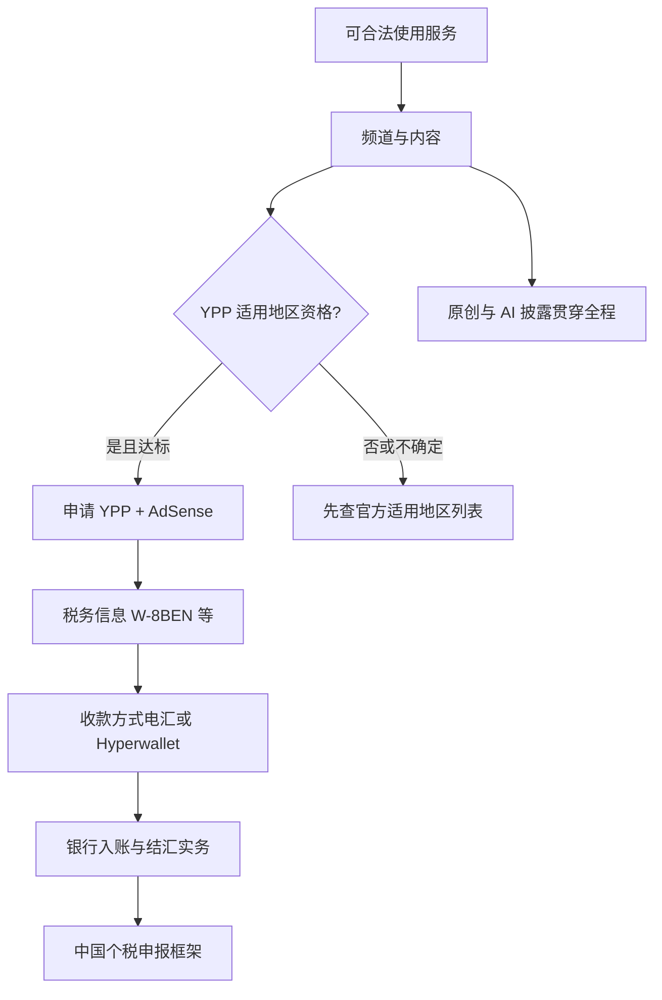
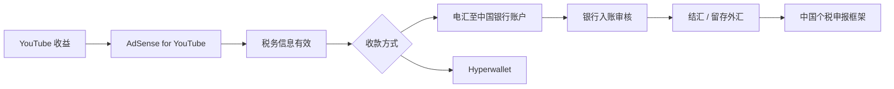

# 13 · 中国大陆创作者专章

> 基准日期：**2026-10-06**（Asia/Shanghai）· 核实补强同日  
> 上一篇：[12 反例与失败模式](12-反例与失败模式.md) · 相关：[09 变现与合规](09-变现与合规红线.md) · [11 FAQ](11-常见问题FAQ.md)  
> 目标：回答「国内怎么做油管」背后的真实关卡——**地区资格、收款、税务、原创**——并全部可回溯到公开来源。

---

## 目录

1. [核实状态表](#核实状态表-2026-10-06)
2. [合规与网络前提（先读）](#_1-合规与网络前提-先读)
3. [账户、频道与地区选择](#_2-账户、频道与地区选择)
4. [YPP：门槛与适用地区](#_3-ypp-门槛与适用地区)
5. [AdSense 收款：电汇、银行与结汇](#_4-adsense-收款-电汇、银行与结汇)
6. [美国税务信息（W-8BEN）](#_5-美国税务信息-w-8ben)
7. [中国个人所得税框架](#_6-中国个人所得税框架)
8. [搬运、二次利用与 Shorts 原创](#_7-搬运、二次利用与-shorts-原创)
9. [双平台：B 站 / 抖音 / 视频号](#_8-双平台-b-站-抖音-视频号)
10. [AI 配音与合成内容披露](#_9-ai-配音与合成内容披露)
11. [高意图 FAQ（独立页）](13-大陆FAQ.md)
12. [本章检查清单](#_11-本章检查清单)
13. [本周作业](#本周作业)

---

## 5分钟速读

> 先扫这几条再往下精读；细节与证据等级见正文。

- **网络**：稳定访问 YouTube / Studio / AdSense 是创作前提；本指南**不提供**任何规避本地网络管理的操作说明。【合规】
- **YPP 地区**：【官方】须居住在已推出 YPP 的国家/地区。截至 **2026-10-06** 核对，[适用地区列表](https://support.google.com/youtube/answer/7101720?hl=zh-Hans)含**香港、台湾**等，**名单中未见「中国」**。请打开原链核对当日。
- **收款**：【官方】收款地址为**中国**时，AdSense / YouTube 支持**电汇**与 **PayPal Hyperwallet**。入账成败还受银行与外汇实务影响。【行业实践】
- **美税**：未交税表时个人账号可按**全球收入约 24%** 预扣；交表后通常只对**美国观众来源**预扣。中美条约下特许权使用费常见上限 **10%**（YouTube 常勾选「其他版权版税」）；以后台税率为准。【官方】
- **中国税**：境外所得有申报/抵免框架；**所得项目须按事实归类**（非一律「特许权使用费」）；**本文非税务意见**。
- **银行费**：Google 不收电汇费；工行/招行公开口径多为**本行不收入账手续费**，**中间行仍可能扣费**——以开户行当日价目为准。
- **原创**：搬运无实质改造 → 变现与 Shorts 分发双杀；AI 写实合成要披露，克隆自己声音旁白通常免披露。【官方】
- **神话拆穿**：【神话】「中国 AdSense 完全收不到钱」——与官方付款国家表不符；【神话】「随便选个高 RPM 国家」——虚假税务居民身份属于高风险，本指南不教。

---

## 核实状态表（2026-10-06）

> 针对写作时标为「不确定」的五项，用公开官方来源复核。结论以「可核 / 部分可核 / 仍须自查」标注。

| # | 议题 | 结论摘要 | 状态 | 主来源 |
|---|------|----------|------|--------|
| 1 | 大陆银行卡收 AdSense 电汇的**本行**手续费 | Google **不收**电汇费；工行官网写明**不收境外汇入手续费**；招行公开页写明**不收入账手续费（国外中间行除外）**；中转行仍可能从本金扣费 | **可核（本行）+ 中间行须自查** | [AdSense 电汇 FAQ](https://support.google.com/adsense/answer/6025222?hl=zh-Hans)；[工行汇入说明](https://www.icbc.com.cn/page/721852463664889903.html)；招行境外汇款产品页 |
| 2 | 中国居民美税预扣税率 | 未交税表：个人账号可按**全球收入约 24%**；交表无协定：**美国观众来源约 30%**；中美条约特许权使用费常见上限 **10%**（YouTube 常归「其他版权版税」主张）；**以后台 Manage tax info 显示为准** | **可核（框架）** | [YouTube 美国税务](https://support.google.com/youtube/answer/10391362)；[IRS 条约表](https://www.irs.gov/pub/irs-lbi/tax-treaty-table-1.pdf)；[条约 PDF](https://www.irs.gov/pub/irs-trty/china.pdf) |
| 3 | 中国个税所得项目归类 | **无**公开总局条文把「YouTube/AdSense」钉死为唯一税目；实施条例分别定义特许权使用费 / 劳务报酬 / 经营所得 / 稿酬——**依事实归类**；境外所得与抵免框架见 2020 年第 3 号公告 | **部分可核（框架）· 个案须顾问/12366** | [实施条例](https://www.gov.cn/zhengce/content/2018-12/22/content_5351177.htm)；[2020 年第 3 号](https://12366.chinatax.gov.cn/bzds/082/082-5-4.html) |
| 4 | Hyperwallet 中国可用性与费用 | **可用**（官方 2025-10-30 宣布中国发布商可用）；YouTube/AdSense 付款表均为适用；须**新建** Hyperwallet 账号；**具体提现费率不在 Help 写死**，登录后查看 | **可用性可核 · 费率须登录自查** | [中国可用公告](https://support.google.com/adsense/answer/16691394?hl=zh-Hans)；[Hyperwallet 收款说明](https://support.google.com/adsense/answer/15292512?hl=zh-Hans)；[付款方式表](https://support.google.com/adsense/answer/1714397?hl=zh-Hans) |
| 5 | 频道「所在国家/地区」与 YPP / AdSense 关系 | 【官方】Studio「所在国家/地区」**决定 YPP 资格**；另须居住在 YPP 适用地区；AdSense 银行须与收款地址**同国**；虚假身份/地址会在 PIN、KYC、税表、银行名一致性上失败——本指南不教虚假申报 | **可核** | [管理频道设置](https://support.google.com/youtube/answer/2976814?hl=zh-Hans)；[YPP 资格](https://support.google.com/youtube/answer/72851?hl=zh-Hans)；[适用地区](https://support.google.com/youtube/answer/7101720?hl=zh-Hans)；[付款 FAQ 银行同国](https://support.google.com/adsense/answer/7164701?hl=en) |

---

## 1. 合规与网络前提（先读）

### 1.1 本站立场

本专章服务**合法、可持续**的华语/大陆背景创作者：

- 遵守你所在地的法律法规与平台规则  
- **不**提供虚假互动、刷量、关键词堆砌、规避平台或本地法规的方法  
- 税务与外汇仅整理**公开政策线索**，**不构成法律、税务或投资建议**

涉及金钱与合规（YMYL）时，优先引用 Google / YouTube Help、IRS、国家外汇管理局与税务机关公开文件；第三方实操标【行业实践】并注明日期。

### 1.2 网络访问（仅作前提说明）

创作、上传、数据分析、关联 AdSense，都需要你能使用 YouTube 与 Google 相关服务。

**【合规表述】**：请自行确保网络使用方式符合你所在地的法律法规与服务条款。本指南**不讨论、不示范**任何规避网络管理的技术或产品。

### 1.3 与全书的关系

| 主题 | 去哪读 |
|------|--------|
| 推荐、冷启动、包装、Shorts 漏斗 | 01–08 章 |
| YPP 门槛数字、质量红线、虚假互动 | [09](09-变现与合规红线.md) |
| 通用 Q&A | [11](11-常见问题FAQ.md) |
| 文献对照 | [SOURCES](SOURCES.md) |

本专章只补：**大陆创作者搜索意图最强、且全书其他章写得不够细的「地区 × 收款 × 税务 × 原创」**。

---

## 2. 账户、频道与地区选择

### 2.1 基础设置（通用）

**【官方 / 行业实践】** 常见顺序：

1. Google 账号安全：开启**两步验证**（YPP 条件之一）  
2. 创建频道 → 完善头像、横幅、简介、默认语言  
3. YouTube Studio：上传默认设置、权限与高级功能相关验证  
4. 规划内容语言与**目标观众地理**（见 [00 导读 §6](00-导读.md)）

手机号验证等权限细节以 Studio 当前提示为准；不同地区可用功能可能不同。

### 2.2 「国家/地区」到底影响什么？（已核对）

公开文档里，至少有几层容易被自媒体混为一谈：

| 层级 | 【官方】含义 | 你该怎么做 |
|------|--------------|------------|
| Studio **频道「所在国家/地区」** | 【官方原文】「您在此处选择的国家/地区设置**决定了您是否有资格加入** YouTube 合作伙伴计划。」 | 打开 [管理频道设置](https://support.google.com/youtube/answer/2976814?hl=zh-Hans)；选**真实居住**相关选项 |
| YPP **居住地 / 适用地区名单** | 须「居住在已推出 YPP 的国家/地区」；名单另列 | [YPP 资格](https://support.google.com/youtube/answer/72851?hl=zh-Hans) + [适用地区](https://support.google.com/youtube/answer/7101720?hl=zh-Hans) |
| AdSense **收款地址国家** | 决定可用付款方式；且【官方】银行须与收款地址**同一国家/地区** | [付款方式表](https://support.google.com/adsense/answer/1714397?hl=zh-Hans)；[Payments FAQs](https://support.google.com/adsense/answer/7164701?hl=en) |
| **税务居民国（W-8 / W-9）** | 决定预扣与协定待遇；YouTube 以税表声明的居住国判定是否「美国境内创作者」 | 以真实税务居民身份为准 |

**【官方链条】** 频道国家设置 → YPP 资格判断；收款地址/银行同国 → 能否电汇；税表居住国 → 美税预扣。三者不一致时，PIN/身份验证/付款拒收/税表拒批风险上升。

**【神话】**「为了 RPM 更高，随便选美国/某国。」  
**【拆穿】** Help 把频道国家与 YPP 资格绑定；AdSense 要求银行与地址同国；虚假申报与身份/PIN/税表交叉校验冲突。本指南**不提供**选区套利或虚假居住地操作。

**【行业实践】** 若你**合法**居住在名单内地区（如香港、台湾等），以当地合格顾问与后台真实选项为准。

### 2.3 开频道前的三问（写下来）

1. 我的**目标观众**主要在哪（海外华人 / 东南亚 / 英语市场 / 其他）？  
2. 我的**税务居民**身份是什么（自己确认，不猜测）？  
3. 我是否已打开官方页，确认 **YPP 是否对我适用**？

答不清就先做内容与受众，不要先纠结「收款神话」。

---

## 3. YPP：门槛与适用地区

### 3.1 门槛（数字以 Help 当日为准）

**【官方】** 截至写作时，完整广告等功能的**现行**常见结构为（请打开原链核对；**2027-02-01 起新申请人见 [§3.3](#_3-3-2027-02-01-起新门槛)**）：

- 过去 12 个月 **1,000** 订阅，且有效公开视频观看时长 **4,000** 小时；**或**  
- 过去 90 天 **1,000** 订阅，且有效 Shorts 观看 **1,000 万** 次  

另需：遵守频道创收政策、无未解除社区准则警示、两步验证、高级功能权限、关联有效 AdSense YouTube 广告账号，以及**居住在已推出 YPP 的国家/地区**。  
来源：[YPP 概览与资格](https://support.google.com/youtube/answer/72851?hl=zh-Hans)

扩展 YPP（较早接触部分粉丝功能）见 Help 扩展计划页；细节见 [09 章](09-变现与合规红线.md)。

**【官方】** 达标 ≠ 自动通过；频道会进入审核（公开说明常见约一个月量级，可能更久）。拒绝后有申诉/等待期规则，见同一 Help 页。→ 数字进度：[YPP 进度计算器](ypp-进度计算器.md)；审核、21 天申诉、30/90 天重新申请：[YPP 审核与申诉](ypp-审核被拒与申诉.md)。

### 3.2 对中国大陆创作者最关键的一句

**【官方 · 2026-10-06 核对】** [YouTube 合作伙伴计划的适用地区](https://support.google.com/youtube/answer/7101720?hl=zh-Hans) 长列表中：

- **包含**：香港、台湾……（及其他数十个国家/地区）  
- **未出现**：名称为「中国」的条目  

因此：

- 若你的情况属于「居住在名单外地区」，公开规则下**不能假设**可以申请 YPP。  
- 列表会更新——**动手前必须打开原链**。  
- 本站不猜测「未列出是否等于永久不可」之外的内部例外；只陈述公开页。

Studio 提示「创收功能无法在您所在地区使用」→ 逐条官方依据与误区对照见 [专页](创收功能无法在您所在地区使用.md)。

### 3.3 2027-02-01 起新门槛

**【官方 · 已核实】** 自 **2027-02-01** 起，**新申请人**广告/Premium：**8,000** 合格小时 / 365 天或 **2,000 万** Shorts / 90 天（仍须 1,000 订阅）；粉丝赞助/Shopping 门槛不变；已在 YPP 者进入门槛不受影响。完整对照与原文 → [YPP 中国大陆资格](ypp-中国大陆资格.md#_2027-02-01-起新门槛)；亦见 [09 §3](09-变现与合规红线.md#_3-2027-02-01-起新门槛-已核实官方数字)。若已具备地区资格且接近现行门槛，变更生效前可按 Help 当日展示的现行数字申请。

### 3.4 AdSense 关联注意

**【官方】** AdSense YouTube 广告账号应通过 **YouTube 工作室**创建/关联；勿自行在 adsense.com 另开导致拒批。同一收款人名下重复 AdSense 账号可能导致创收被停用。  
来源：[设置 AdSense YouTube 广告账号](https://support.google.com/youtube/answer/9914702?hl=zh-Hans)

---

## 4. AdSense 收款：电汇、银行与结汇

> 前提：你已合法具备可收款的 AdSense YouTube 广告账号。若尚无 YPP 资格，本节供**提前理解流程**，不是鼓励违规开户。

### 4.1 付款前四步（官方框架）

**【官方】** 获得付款前通常需要：

1. 验证个人信息（身份 / 地址；地址常用邮寄 PIN，也可能视地区有在线选项）  
2. 提供税务信息  
3. 选择收款方式  
4. 余额达到支付最低限额（常见示例为 **100 美元** 量级，以你账号设置为准）  

处理周期：例如某月余额达标，可能在**次月月底**安排付款（Help 示例逻辑）。  
来源：[如何在 YouTube 上获得收益](https://support.google.com/youtube/answer/14732067?hl=zh-Hans)

PIN：新账号余额达约 **10 美元** 量级时可能寄出地址验证 PIN（公开帮助常见表述）；逾期未验证会影响创收与付款——以账号提示为准。  
相关：[关联 AdSense](https://support.google.com/youtube/answer/9914702?hl=zh-Hans)

### 4.2 中国可用的官方收款方式

**【官方 · 付款方式国家表】** 当收款国家/地区为**中国**时：

| 产品 | 支票 | 电子转账 | 电汇 | Hyperwallet |
|------|------|----------|------|-------------|
| AdSense | 不适用 | 不适用 | **适用** | **适用** |
| YouTube | 不适用 | 不适用 | **适用** | **适用** |

来源：[添加收款方式](https://support.google.com/adsense/answer/1714397?hl=zh-Hans)（亚太表「中国」行，2026-10-06 抓取）

电汇操作概要：AdSense → 收款 → 管理收款方式 → 电汇 → 填写与银行预留一致的户名、银行名、SWIFT-BIC、账号等。  
来源：[通过电汇接收款项](https://support.google.com/adsense/answer/3372975?hl=zh-Hans)

**【纠正神话】** 大量自媒体写「大陆完全无法收款 / 只能香港卡」。**至少在 Google 公开付款表上，中国支持电汇与 Hyperwallet。** 实务中银行拒收、要求证明、中间行扣费等，属于【行业实践】变量，不等于「官方不支持」。

### 4.3 电汇手续费：官方能核到什么（2026-10-06）

#### Google 侧

**【官方】** Google **不会**对接收电汇收费；你指定的银行可能收费；若到账少于发放额，应问银行佣金/中间行扣费，而非 Google。中转银行信息为选填，美元付款时中转行须在美国。  
来源：[电汇常见问题解答](https://support.google.com/adsense/answer/6025222?hl=zh-Hans)

#### 大陆收款行（本行入账费 · 公开价目/产品页）

| 银行 | 公开表述（摘录） | 文档/页面 | 核对日 |
|------|------------------|-----------|--------|
| **工商银行** | 「**我行不收取境外汇入款手续费**」；FAQ 说明：若经转汇行，**每家转汇行都可能从汇款额中扣转汇费**，故到账可能少于汇出额 | [其他个人跨境汇入汇款](https://www.icbc.com.cn/page/721852463664889903.html) | 2026-10-06 |
| **招商银行** | 储蓄/境外汇款产品说明：**「我行不收取任何入账手续费（国外中间行的扣费除外）」**；部分分行或收无兑换手续费，以当地分行为准 | 招行官网「境外汇款」储蓄业务说明（`cmbchina.com` 个人储蓄产品页；抓取时偶发 500，请浏览器复核） | 2026-10-06 |
| **中国银行** | 2025-11 个人服务价目 PDF 对**个人跨境汇出**列明电汇/票汇约 **1‰（最低 50 / 最高 260 元）+ 电讯费**；**正常「境外汇入入账」未在同表列为对收费人固定价目**——解付后退汇/转汇另计。**入账是否收费请向柜台确认当日口径** | [中行个人金融价目 PDF](https://pic.bankofchina.com/bocappd/pricelist/202511/P020251110646838136627.pdf)（2025-11 版） | 2026-10-06 |
| **建设银行** | 公开栏目强调咨询 95533；未在本次检索中找到与工行同级「汇入一律免本行费」的统一一句——**须向开户行索取现行《服务价目表》** | [建行服务价目表栏目](https://group.ccb.com/chn/2022-01/12/article_2022011211360938598.shtml) | 2026-10-06 |

**【仍须你自己问柜台的】**

1. 你这张卡/账户是否允许接收 **Google / 新加坡等地**来账（银行风控可能拒收，与「价目是否免费」是两件事）  
2. 本笔是否走了几家**中间行**、各扣多少（只有 SWIFT 报文/银行流水能看见）  
3. 无兑换/结汇是否另收费、当日汇率  

**【结汇】** 个人经常项目便利化额度等口径见 SAFE 规章；超额凭真实性材料办理——仍以银行/外管现行操作为准（见 SOURCES #52）。

### 4.4 PayPal Hyperwallet（中国 · 已核对）

**【官方 · 2025-10-30】** Google 宣布**中国**（与阿根廷）发布商可通过 Hyperwallet 接收 AdSense / AdMob / Ad Manager 收入；可进一步转到 PayPal 或取现等。  
来源：[中国可用公告](https://support.google.com/adsense/answer/16691394?hl=zh-Hans)

**【官方 · 付款表】** 收款国家为「中国」时，AdSense 与 YouTube 列均为 Hyperwallet **适用**（与电汇并列）。  
来源：[添加收款方式](https://support.google.com/adsense/answer/1714397?hl=zh-Hans)

**【官方 · 使用要点】**（[通过 PayPal Hyperwallet 收款](https://support.google.com/adsense/answer/15292512?hl=zh-Hans)）

- 设置时须**创建新的** PayPal Hyperwallet 账号，**不能**复用已有 Hyperwallet  
- 达到支付门槛且无暂停付款时，收入存入 Hyperwallet；Help 称入账后常见 **1–2 天**可见  
- 邮件通知常见于每月约 **21–26 日**区间（以实际邮件为准）  
- **「您可能需要向 PayPal 支付费用才能使用某些支付方式。登录 Hyperwallet 账号后可查看确切费用。」** → **公开 Help 不公布中国提现固定费率表**

**【仍不可核的】** 人民币本地通道、速汇金/电汇提现的**精确费率与可用性**会变，必须以你登录后的报价与条款为准。第三方（连连等）非 Google 官方必选项，另读其合同。

---

## 5. 美国税务信息（W-8BEN）

> **【重要】** YouTube / Google **不提供**税务建议；本节只帮助你读懂公开 Help 与条约文本方向。请咨询合格税务专业人士。

### 5.1 为什么人人都要填

**【官方】**

- 所有启用创收的创作者都要提交美国税务信息（不论是否人在美国）  
- Google 可能对**来自美国境内观看者**的 YouTube 收益预扣税款  
- **未提交**时，个人账号类型可能按**全球总收入最高约 24%** 预扣；企业境外账号等另有默认规则  
- 提交有效信息后，预扣通常针对适用的美国来源收益，税率常在 **0–30%**（视居住国与协定）  
- 建议关注每年约 **12 月 10 日** 前提交/更新以便协定待遇等（见 Help 提示）  
- 表单会过期，通常需每隔几年重提  

来源：[适用于 YouTube 收入的美国税务规定](https://support.google.com/youtube/answer/10391362?hl=zh-Hans) · [向 Google 提交美国税务信息](https://support.google.com/youtube/answer/10390801?hl=zh-Hans)

### 5.2 中国税收居民常见表单类型

**【官方方向】** 美国境外的个人受益所有人通常使用 **W-8BEN**；实体用 **W-8BEN-E**。最终以 AdSense 税务工具指引为准。

填写时姓名、地址应与收款/验证资料一致；使用拉丁字符等 IRS 要求见 Help。

### 5.3 预扣税率对照（已用官方页交叉核对）

| 情形 | 公开口径 | 来源 |
|------|----------|------|
| **未提交**美国税务信息 · **个人**账号 | 备用预扣：最高约 **全球总收入的 24%** | [YouTube 美国税务](https://support.google.com/youtube/answer/10391362) |
| **未提交** · **企业**且收款人在美国境外 | 默认约 **美国来源收入的 30%** | 同上 |
| **已提交**但**无**有效协定待遇 | 通常按 **美国观众来源收入约 30%**（法定上限量级） | 同上 Help 示例 |
| **已提交**并主张中美协定 · 特许权使用费 | IRS《Tax Treaty Table 1》(Rev. May 2023)：**China, People's Rep. of** 下版权等 Royalties 列为 **10%**；条约正文 Royalties 条上限 **10%** | [Table 1 PDF](https://www.irs.gov/pub/irs-lbi/tax-treaty-table-1.pdf)；[条约 PDF](https://www.irs.gov/pub/irs-trty/china.pdf) |
| YouTube 建议勾选的协定收入类型 | Help 点名：**Other Copyright Royalties（如 YouTube 合作伙伴计划）**；另有 **Services（如 Google AdSense）** | 同上 YouTube Help |

**【务必理解】**

- 协定 **10%** 是符合条件的特许权使用费**上限框架**，不是保证后台一定显示 10%  
- 设备租金等在条约/表中另有计算（如对毛租金按 70% 计税等）——与典型 YPP 版税主张不同  
- **以 AdSense「管理税务信息」页显示的 withholding rate 为准**  
- Google/YouTube **不提供**税务建议；本站不提供「唯一正确填表截图」

### 5.4 年终表格

**【官方】** 适用创作者可能收到 **1042-S** 等（非美国人士常见）记录预扣；可在税务设置中选择电子递送。用于后续本国抵免材料时，按当地税务机关要求准备。

---

## 6. 中国个人所得税框架

> **【非税务意见 · 非法律意见】** 以下仅指向公开政策框架，帮助你知道「该去问谁、查哪类文件」。具体税目、扣除、抵免与是否构成纳税义务，以主管税务机关与合格顾问意见为准。

### 6.1 所得项目：为什么「不能写死」

**【官方 · 实施条例定义】**（《个人所得税法实施条例》第六条，政府网公布文本）

| 项目 | 条例定义要点（摘录精神） |
|------|--------------------------|
| **劳务报酬** | 个人从事劳务取得的所得，列举含**广告**、技术服务、演出等 |
| **稿酬** | 作品以图书、报刊等形式**出版、发表**取得的所得 |
| **特许权使用费** | 提供专利权、商标权、**著作权**、非专利技术等特许权的**使用权**取得的所得；提供著作权使用权取得的所得**不包括稿酬** |
| **经营所得** | 个体工商户/个独合伙经营、依法有偿服务、承包承租，以及「其他生产、经营活动」 |

来源：https://www.gov.cn/zhengce/content/2018-12/22/content_5351177.htm  

**【核实结论 · 2026-10-06】** 我们检索了 12366 / 总局公开库，**未发现**把「YouTube 广告分成 / AdSense」**统一强制**归入某一税目的现行总局公告。因此：

- 若实质是许可著作权等在境外使用 → 可能更贴近**特许权使用费**讨论  
- 若实质是提供广告投放/技术服务劳务 → 可能进入**劳务报酬**讨论  
- 若以个体经营/工作室持续经营 → 可能涉及**经营所得**  
- 「视频发在网上」≠自动等于稿酬（稿酬强调图书报刊等出版发表形式）

**最终归类以主管税务机关与合格税务专业人士意见为准。** 博文「一律特许权使用费 + 20%」=【行业解读】，**不是**本站结论。

### 6.2 境外所得申报与抵免（可核框架）

**【官方 · 财政部 税务总局公告 2020 年第 3 号】**

- 境外综合所得与境内综合所得**合并**计税；经营所得合并；利息股息等其他分类所得单独计税  
- 境外已缴所得税可在**抵免限额**内抵免；超限额可结转五年等规则  
- 申报期：取得所得**次年 3 月 1 日至 6 月 30 日**  
- 抵免一般需完税证明等；无法提供时，公告允许在符合条件时凭境外申报表/缴税通知 + 银行缴款凭证等办理  

来源：[12366 公告文本](https://12366.chinatax.gov.cn/bzds/082/082-5-4.html) · [政府网](https://www.gov.cn/zhengce/zhengceku/2020-01/22/content_5471604.htm)

美国侧预扣（如 1042-S）**可能**构成可抵免境外所得税性质税额的候选材料，但能否抵免、限额多少，仍依中国税法与凭证审核——**非自动全额抵免**。

### 6.3 实务上建议保留的材料（非完整清单）

- AdSense / YouTube 付款收据与收入明细导出  
- 预扣税证明（如 1042-S）  
- 银行入账与结汇记录  
- 汇率折算依据（保持方法一致；实施条例对外币折算有规则）  

金额以**实际结算/到账逻辑**为准，不要只拿 Studio「预估收入」报税。【行业实践】

美国侧预扣 ≠ 免除中国申报义务。

---

## 7. 搬运、二次利用与 Shorts 原创

### 7.1 频道创收政策：二次利用内容

**【官方】** 「二次利用的内容」指重新利用 YouTube 或其他网络来源现有内容，却**未**加入有意义原创评论、实质性修改或教育/娱乐价值。审核看**整个频道**，不单看一条。  
**即便已获版权许可，仍可能不符合该政策。**  
来源：[频道创收政策](https://support.google.com/youtube/answer/1311392?hl=zh-Hans)

可接受方向示例（官方列举精神）：有评论的反应视频、有分析的回放、有叙事的混剪、本人出镜讲解等。  
高风险：纯合集、跨平台搬运拼接、只改速改调、朗读他人文案、无解说模板刷屏。官方「可以 / 不可以」例子逐条对照 → [再利用内容自查表](ypp-审核被拒与申诉.md#再利用内容自查表)。

### 7.2 「不实内容」与批量模板（2025 政策更名 clarifications）

**【官方】** 原「重复性内容」等方向更新为更清晰的「不实内容」表述（政策页更新日志），打击模板化、批量、情绪操控、敏感领域 AI 人设等。详见同一创收政策页与 [09 章](09-变现与合规红线.md)。

### 7.3 Shorts：2026-10 原创优先

**【官方表述经 Creator 渠道传播 + 多家报道】** 约 **2026-10-01** 起，Shorts 推荐更倾向原创，降低无实质再上传内容的分发。加滤镜、简单裁切通常不够。  
交叉阅读：Spam 政策与本站 [SOURCES §5](SOURCES.md)、[06 Shorts](06-Shorts漏斗.md)。

**【神话】** 「先搬运涨粉再原创。」  
**【拆穿】** 2026 年变现审核 + Shorts 分发同时打压无实质搬运；冷启动更应直接做可辩护的原创增量。

---

## 8. 双平台：B 站 / 抖音 / 视频号

**【行业实践】** 同一选题多平台分发可以，但建议：

| 做法 | 原因 |
|------|------|
| **改编**时长、封面、标题、钩子 | 各平台推荐与社区习惯不同 |
| YouTube 版保证**独立完整价值** | 避免「半截引流」伤害留存 |
| 核对**音乐/素材授权**是否覆盖各平台 | 版权主张互相独立 |
| 不把「一键同步未改」当策略 | 增加 reused / 同质风险，且对增长无益 |
| 评论区问题反哺选题 | 合法的跨平台研究 |

本站不维护具体第三方「自动发布」工具名单；使用任何自动化上传须遵守各平台条款，并避免垃圾行为。【官方】虚假互动与 Spam 红线见 [09](09-变现与合规红线.md)。

---

## 9. AI 配音与合成内容披露

**【官方】** 利用生成式 AI **实质性加工或生成写实内容**时，须在 Studio「AI 使用情况」中披露；标签本身**不**限制观众群，也**不**自动取消创收资格。一再故意不披露可能被标签或处罚（含影响 YPP）。  
来源：[披露生成式 AI 内容的使用情况](https://support.google.com/youtube/answer/14328491?hl=zh-Hans)

| 场景 | 通常是否需披露（官方示例精神） |
|------|--------------------------------|
| 克隆**自己的**声音做旁白/配音 | **通常不需要** |
| 美颜、调色、字幕、脚本辅助、画质增强 | **通常不需要** |
| 使真实人物看似说了未说的话 / 做了未做的事 | **需要** |
| 生成未发生的写实事件/地点场景 | **需要** |
| 作为视频核心的 AI 生成音乐 | **需要** |

敏感领域（健康/法律/金融等）用 AI 人设冒充专家：另受创收政策限制，见 [09](09-变现与合规红线.md)。

---

## 10. 高意图 FAQ（已拆页）

完整问答（国内怎么做、YPP、电汇、W-8BEN、个税、搬运、AI 披露等）已拆到独立页，便于搜索与加载：

→ **[中国大陆做 YouTube：高意图 FAQ](13-大陆FAQ.md)**

专题短页：

- [中国大陆能申请 YPP 吗？](ypp-中国大陆资格.md)
- [AdSense 中国电汇收款怎么设置](adsense-电汇收款.md)

---

## 11. 本章检查清单

- [ ] 已打开并保存 YPP [适用地区](https://support.google.com/youtube/answer/7101720?hl=zh-Hans) 与 [资格](https://support.google.com/youtube/answer/72851?hl=zh-Hans) 两页（核对日期：____）  
- [ ] 已写清目标观众地理与内容语言（链 [00](00-导读.md)）  
- [ ] 两步验证已开；理解 AdSense 须经 Studio 关联  
- [ ] 若已创收：税务信息状态、收款方式、地址验证均已检查  
- [ ] 频道抽检：是否存在无实质搬运 / 模板刷屏 / 未披露写实 AI  
- [ ] 双平台：有改编计划，而非纯镜像  
- [ ] 已阅读「非税务/法律意见」声明；需要时已预约顾问  

---

## 本周作业

> 2–5 件可完成的具体动作；做完打勾。

1. [ ] 打开 YPP 适用地区页，用自己的话写三句：名单里有没有「中国」、有哪些与我相关的邻近地区名称、我下一步要向谁核实居住/税务身份。  
2. [ ] 打开 AdSense [付款方式国家表](https://support.google.com/adsense/answer/1714397?hl=zh-Hans)，截图或笔记「中国」一行的可用方式。  
3. [ ] 从你最近 10 条视频（或选题池）标出：原创增量是什么；若被问「是否二次利用」，你怎么答辩。  
4. [ ] 若使用 AI 配音/画面：对照[披露页](https://support.google.com/youtube/answer/14328491?hl=zh-Hans)做一次「要不要披露」判定表。  
5. [ ] 打开 [大陆 FAQ](13-大陆FAQ.md)，把 Q2、Q3、Q5、Q6、Q7 用自己的话各缩成 30 字（备忘录）。

---

**下一站**：回到 [10 审计清单](10-通用审计清单.md) 做一次频道体检；文献更新记入 [SOURCES](SOURCES.md)。

