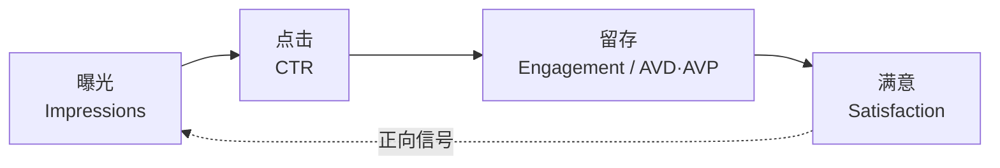
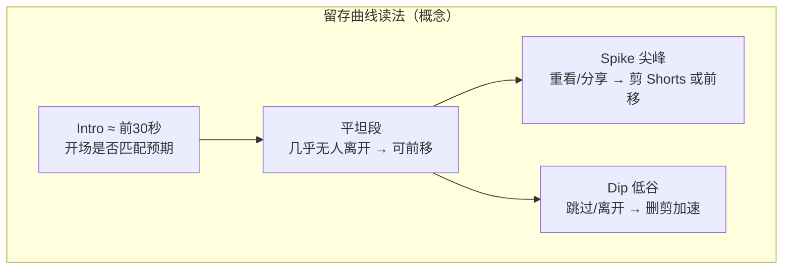
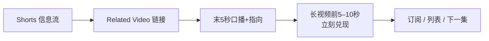

# 图示索引

> Mermaid 图可在 GitHub / 多数静态站渲染。若本地预览不显示，可粘贴到 [mermaid.live](https://mermaid.live)。  
> 源文件嵌在各章；本页便于打印与课堂投影。

---

## 1. 推荐漏斗（曝光 → 满意）

详见 [01 · 创作者侧四段漏斗](01-推荐系统心智模型.md)。

**配套官方三桶**：Appeal（吸引）→ Engagement（粘住）→ Satisfaction（满意）。

---

## 2. 留存曲线标注概念

详见 [05 · Studio 关键时刻](05-脚本留存与完播.md)。

**诊断口诀**：CTR 好 · Intro 崩 → 包装/开场；Intro 尚可 · Dip 密 → 结构/密度。

---

## 3. Shorts → 长视频 Related 路径

详见 [06 · 官方四步](06-Shorts漏斗.md)。

---

## 4. 选题漏斗（文字版，见第 03 章）

灵感 → 谁会点 → ≥8 标题+≥3 封面概念 → 能兑现 → 进内容桶 → 本月拍摄池  
（完整步骤：[03 定位选题](03-定位选题与系列化.md)）

---

## 相关一页纸

- [作战卡.md](作战卡.md) — 漏斗 + 包装 + Shorts 桥 + 节奏 + 红线  
- [10 审计清单](10-通用审计清单.md) — 可打印记分表
